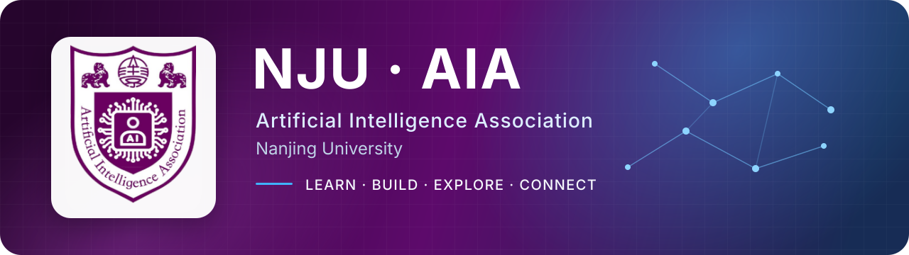

  

  <strong>探索人工智能 · 连接学习与实践 · 共建开放的校园 AI 社区</strong> 
  From first principles to real projects, from learning together to building together.

  
  
  
  

---

## About NJU-AIA

NJU-AIA 是南京大学的人工智能学生社区。我们关注 **AI 知识普及、入门引导、学术交流与实践创新**，欢迎不同专业、不同基础的同学参与。

我们通过定期技术分享与讨论、项目实践和比赛协作，把“学到的 AI”变成“做出来的 AI”，并持续沉淀开放、可复用的学习资料与代码。

## What we do

<table>
<tr>
<td width="50%" valign="top"><b>01 · Learn</b> 从神经网络基础到生成模型，提供循序渐进的学习内容与实践代码。</td>
<td width="50%" valign="top"><b>02 · Share</b> 定期讨论与技术分享，交流 AI 前沿、课程应用与工程实践中的真实问题。</td>
</tr>
<tr>
<td width="50%" valign="top"><b>03 · Build</b> 围绕项目与比赛组队协作，把想法快速落地为可以运行、验证和迭代的作品。</td>
<td width="50%" valign="top"><b>04 · Connect</b> 连接不同方向与背景的同学，建设开放、活跃、长期生长的校园 AI 社区。</td>
</tr>
</table>

## Start exploring

最新内容由 GitHub Actions 自动从 [nju-aia.com](https://nju-aia.com) 同步。

<!-- AIA_FEED:START -->
- **[【活动预告】成为 AI-Native 大学生：用大模型与 Coding Agent 提升生产力](https://nju-aia.com/reader?id=b41d4e7d)**  
  Preview · 2026-09-12 · 南的AIA
- **[【龙虾快闪+讲座双预告】玩转 AstronClaw龙虾，奶茶券耳机大疆等大奖等你来拿！](https://nju-aia.com/reader?id=ea156dc4)**  
  Preview · 2026-04-15 · 南大创协
- **[【讲座预告】Vibe Math——AI如何颠覆数学研究](https://nju-aia.com/reader?id=461b7104)**  
  Preview · 2026-04-14 · 南的AIA
- **[FlowMatching-DiT](https://nju-aia.com/reader?id=9fdbe90a)**  
  Tutorial · 2026-04-14 · 李子墨
- **[vae简介](https://nju-aia.com/reader?id=52d5d691)**  
  Tutorial · 2026-04-10 · 曾睿鸣
- **[ddpm简介](https://nju-aia.com/reader?id=e68228bb)**  
  Tutorial · 2026-04-10 · 陈旭枫
<!-- AIA_FEED:END -->
## Build with us

我们的仓库覆盖 **Python · Jupyter Notebook · Go · Vue · Astro · Nix** 等技术栈。欢迎从阅读资料、运行示例、改进文档开始，也欢迎通过 Issue 和 Pull Request 参与建设。

  <a href="https://github.com/NJU-AIA?tab=repositories"><b>Explore repositories →</b></a>
  &nbsp;&nbsp;·&nbsp;&nbsp;
  <a href="mailto:NJU_AIA@163.com"><b>Contact us →</b></a>

---

  QQ群：897201506 · 微信公众号：南的AIA · Email：NJU_AIA@163.com

